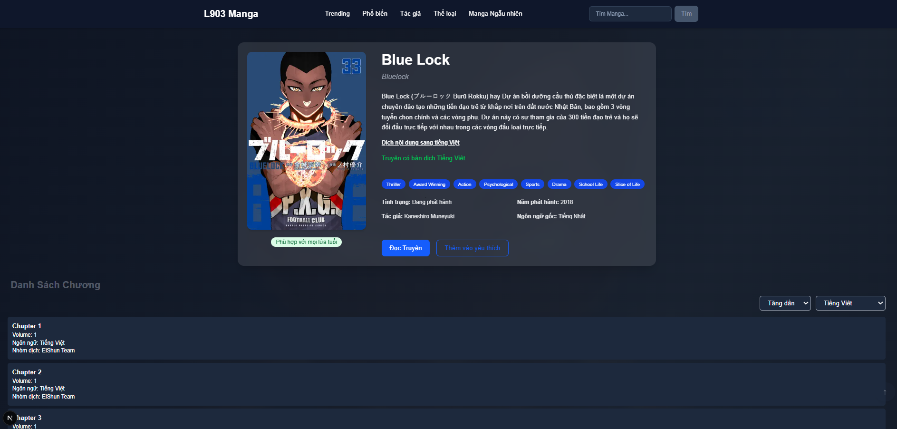
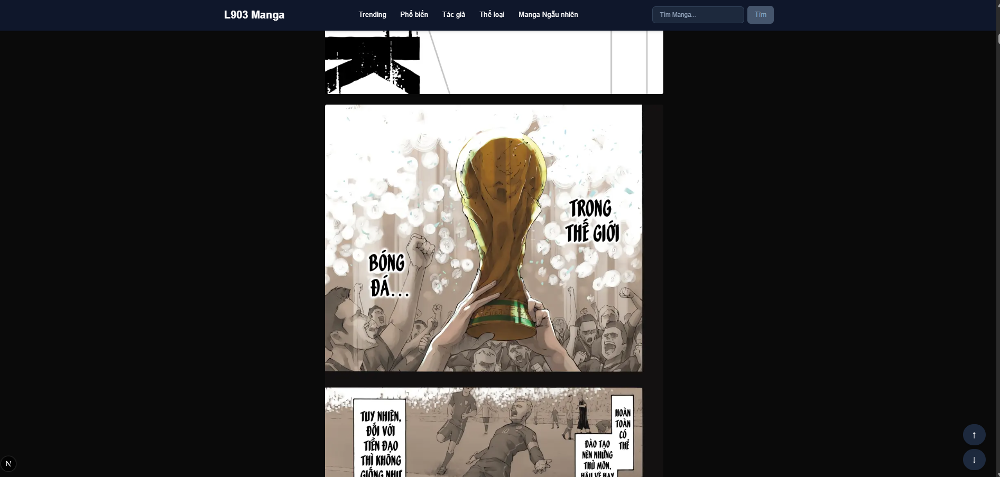

# 📚 L903-Manga

**L903-Manga** sử dụng dữ liệu từ [MangaDex API](https://api.mangadex.org) với giao diện hiện đại và mượt mà.

## 🚀 Tính năng nổi bật

- 🔍 Tìm kiếm và xem chi tiết manga
- 📑 Danh sách chương có thể lọc theo ngôn ngữ (ưu tiên tiếng Việt, fallback sang tiếng Anh)
- ⏩ Chuyển chương liền mạch, giữ nguyên vị trí offset
- 🌐 Hỗ trợ đa ngôn ngữ (dựa theo chapter)
- 🧠 Sử dụng React Query để caching & quản lý dữ liệu
- ⚙️ Kết nối với MangaDex thông qua proxy API nội bộ để tránh CORS

## 🛠️ Công nghệ sử dụng

- [Next.js](https://nextjs.org/)
- [React](https://reactjs.org/)
- [React Query](https://tanstack.com/query/v4)
- [Tailwind CSS](https://tailwindcss.com/)
- [MangaDex API](https://api.mangadex.org)


 <!-- [image] -->

 <!-- [image] -->

 <!-- [image] -->

## 📂 Cấu trúc thư mục

```bash
.
├── api/                # Gọi API từ MangaDex (qua proxy)
├── components/         # Các component tái sử dụng
├── pages/              # Các route chính: index, manga detail, reader
├── utils/              # Các hàm tiện ích
├── public/             # Ảnh & asset tĩnh
├── styles/             # Cấu hình Tailwind
└── ...

```

```bash

# Clone repo
git clone https://github.com/toanducz/L903-Manga.git

# Cài dependencies
cd L903-Manga
npm install

# Chạy development
npm run dev

